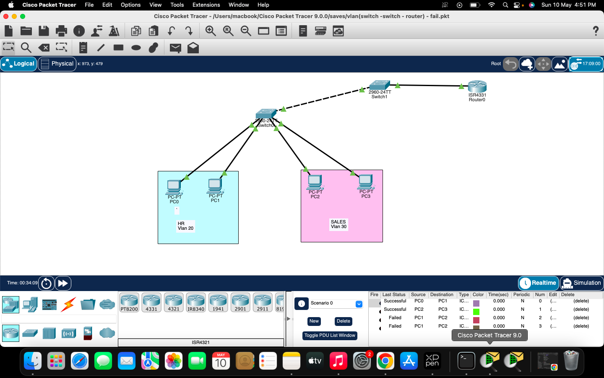

# Enterprise Office Network

## 🧠 About Project
Designed and implemented an enterprise-level office network using VLANs, VTP, trunking, routing, DHCP, DNS.

## 📷 Topology

## ⚙️ Features
- VLAN configuration
- Inter-VLAN routing
- DHCP setup
- DNS services

## 🧰 Tools Used
Cisco Packet Tracer
